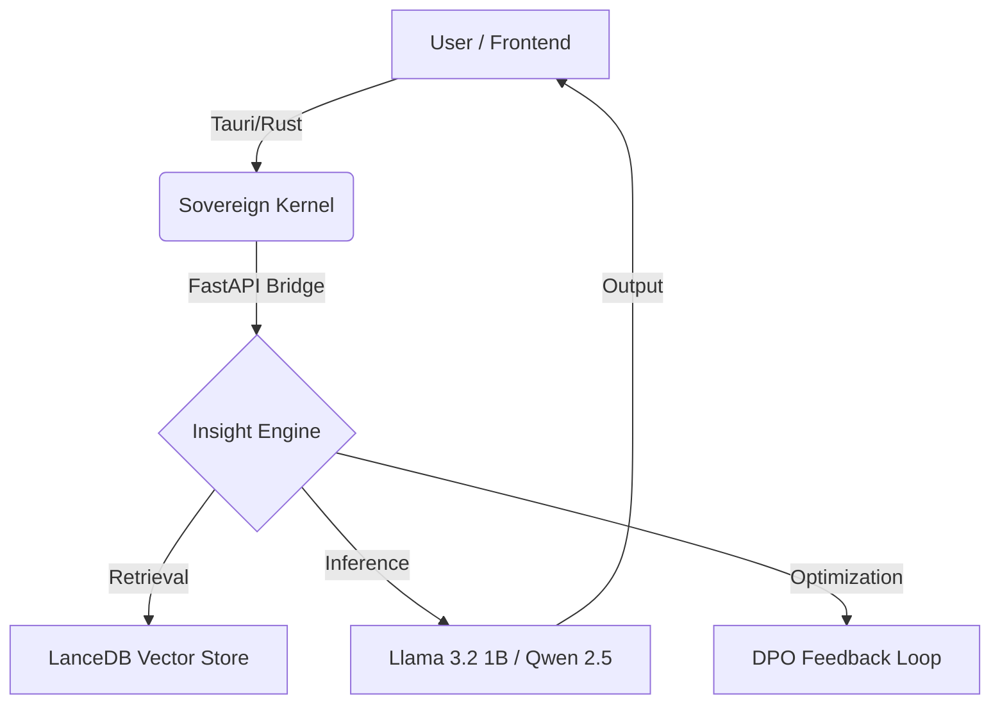

```markdown
# EngelBERT OS (Project Wise)
**The Sovereign Personal Semantic Model (PSM-1)**

  

> "The Butler frees your time. The Lab Partner amplifies your mind."

## 📜 The Mission
We are building **Cognitive Augmentation** software that respects **Data Sovereignty**.
Current AI tools (ChatGPT, Perplexity) are efficient "Butlers"—they do tasks for you. We are building a "Lab Partner"—an active agent that thinks *with* you, discovering non-obvious connections in your private knowledge base without your data ever leaving the device.

## 🏗️ The Architecture (Sprint 2)
EngelBERT is not a wrapper. It is a **Local Operating System for Intelligence**.



### The Tech Stack
*   **Frontend:** Tauri (Rust + React/TS) - *Lightweight, Native Shell.*
*   **Kernel:** Python 3.12 + FastAPI - *The Orchestrator.*
*   **Memory:** LanceDB - *Serverless Vector Storage.*
*   **Model Engine:** `llama-cpp-python` - *Running Quantized Llama 3.2 1B (CPU Optimized).*
*   **Alignment:** DPO (Direct Preference Optimization) - *Learning user taste via local RLHF.*

## 🧩 Key Innovations

### 1. The Insight Engine (PSM-1)
Most "Second Brains" are passive storage. EngelBERT is active.
*   **The Dream Cycle:** A background daemon (`dream_cycle_worker.py`) that runs while the computer is idle.
*   **The Logic:** It scans your past notes, identifies latent connections between disparate topics (e.g., "Biology" and "Architecture"), and presents them as insights.
*   **The Moat:** It learns from your feedback (Save/Dismiss) to maximize **PIV (Personal Insight Value)**.

### 2. Progressive Sovereignty
*   **Stage 1 (Now):** Sovereign Desktop. Runs locally on consumer hardware (Mac M1/M2/M3, Windows).
*   **Stage 2:** Sage Stick. Portable intelligence on a USB drive.
*   **Stage 3:** Wise Orb. Ambient, screenless intelligence.

## 🚀 Getting Started (Developer Setup)

### Prerequisites
*   Python 3.10+
*   Node.js & npm
*   Rust (for Tauri)

### Installation
1.  **Clone the Repo**
    ```bash
    git clone https://github.com/daveAnalyst/EngelBERT.git
    cd EngelBERT
    ```

2.  **Boot the Kernel (Backend)**
    ```bash
    cd src-backend
    pip install -r requirements.txt
    python bootstrap.py  # Downloads Llama-3.2-1B-Instruct-GGUF
    ```

3.  **Launch the Shell (Frontend)**
    ```bash
    # Open a new terminal
    npm install
    npm run tauri dev
    ```

## 🤝 Contributing
We are currently in **Sprint 2: The Insight Engine**.
Check the [Issues Tab](https://github.com/daveAnalyst/EngelBERT/issues) for high-priority bounties.

*   **Engineering:** Focus on `[SYSTEMS]` and `[BACKEND]` tickets (Tauri/Python bridge).
*   **Research:** Focus on `[ML]` tickets (DPO Implementation).

## 📜 License
Apache-2.0. Open Source and Sovereign.

---
*Built by Dave, Davin, JB, Bolaji, Alfa & Aritra.*
```
